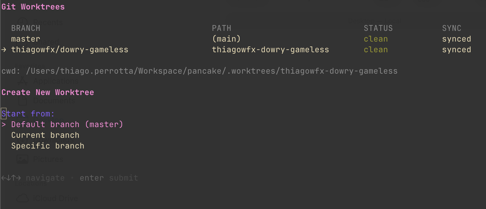

# wt

Manage git worktrees with ease.

## Overview

Git worktrees allow you to check out multiple branches simultaneously in different directories. This tool simplifies common worktree operations with both a CLI and interactive TUI.

## Usage

```bash
wt [COMMAND] [OPTIONS]
```

When invoked without arguments, launches the interactive TUI (requires `gum`).

### Commands

- `tui` - Launch interactive TUI dashboard
- `add [branch] [path]` - Create new worktree (auto-generates branch if omitted). Aliases: `new`, `create`
- `co <pr-number>` - Checkout a PR in a new worktree. Aliases: `checkout`
- `list` - List all worktrees. Aliases: `ls`
- `remove [path]` - Remove worktree (current if no path given). Aliases: `rm`, `del`, `delete`, `bd`
- `move [worktree] [dest]` - Move worktree to new location (interactive with fzf if omitted). Aliases: `mv`
- `prune` - Remove stale worktree administrative files
- `world` - Delete worktrees with merged/deleted remote branches. Aliases: `cleanup`
- `goto [pattern]` - Print path to worktree (interactive with fzf if no pattern)
- `cd [pattern]` - Change to worktree directory in new shell
- `cd -` - Change to main worktree
- `help` - Show help message

### Options

- `-h, --help` - Show help message and exit

## Interactive TUI


Launch the TUI by running `wt` without arguments (or `wt tui` explicitly).

The TUI provides a visual dashboard with:
- Branch name
- Path (relative)
- Status (clean / N changes / merging / rebasing)
- Sync state (↑ahead ↓behind)

### TUI Actions

- **New worktree** - Create from default branch, current branch, or specific branch
- **Check out branch** - Create a worktree for any existing branch (local or remote)
- **Checkout PR** - Fetch a GitHub PR into a new worktree
- **Switch to worktree** - Open a worktree in a new shell
- **Open in editor** - Launch `$EDITOR` (or `code`) in worktree
- **Show diff** - View uncommitted changes
- **Move worktree** - Relocate worktree or extract main worktree to linked worktree
- **Remove worktree** - Delete worktree and its branch
- **Clean** - Batch remove merged/deleted worktrees



## Examples

Launch the interactive TUI:
```bash
wt
```

Quick worktree with auto-generated branch (and cd to it):
```bash
wt add
# Auto-generates: thiago-perrotta/taco-unicorn
# Creates .worktrees/thiago-perrotta-taco-unicorn and changes to that directory
```

Create worktree with specific branch (and cd to it):
```bash
wt add feature-unicorn
# Creates .worktrees/feature-unicorn and changes to that directory
```

Create worktree without changing directory:
```bash
wt add --no-cd feature-unicorn
# Creates ../feature-unicorn but stays in current directory
```

Checkout a PR in a new worktree:
```bash
wt co 42
# Fetches PR #42 and creates worktree in .worktrees/pr-branch-name
```

Checkout a PR without changing directory:
```bash
wt co --no-cd 42
# Fetches PR #42 but stays in current directory
```

Create worktree at specific path:
```bash
wt add feature-dragon ~/projects/myrepo-dragon
```

List all worktrees:
```bash
wt list
```

Remove current worktree and return to main:
```bash
wt remove
# Removes current worktree and changes to main checkout
```

Remove a specific worktree:
```bash
wt remove ../feature-unicorn
```

Navigate to a worktree interactively:
```bash
wt cd
# Opens fzf to select a worktree
```

Navigate to a specific worktree:
```bash
wt cd feature-dragon
```

Return to main worktree:
```bash
wt cd -
```

Navigate to a worktree (alternative using goto and cd):
```bash
cd "$(wt goto feature-dragon)"
```

Clean up stale worktree data:
```bash
wt prune
```

Clean up worktrees for merged branches:
```bash
wt world
# Fetches from remotes and removes worktrees whose upstream branches have been deleted
```

Move a worktree interactively:
```bash
wt move
# Opens fzf to select a worktree, then auto-generates destination
```

Move a worktree to auto-generated path:
```bash
wt move feature-unicorn
# Moves to .worktrees/username-random-words
```

Move a worktree to specific path:
```bash
wt move feature-unicorn ~/projects/new-location
```

Extract main worktree to linked worktree:
```bash
wt move main
# If main is on a feature branch, extracts it to .worktrees/<branch>
# and switches main back to default branch
```

## Features

- Interactive TUI dashboard when invoked without arguments (requires gum)
- Automatically changes directory to new worktree after creation (use --no-cd to skip)
- Checkout GitHub PRs directly in new worktrees with `co` command
- Auto-generates branch names when none provided (username/word1-word2)
- Automatically creates worktrees in `.worktrees` directory within repo when no path specified
- Automatically adds `.worktrees` to `.git/info/exclude`
- Handles new branches, existing local branches, and remote branches
- Simple navigation with `cd` command (spawns new shell in worktree)
- Quick return to main worktree with `cd -`
- Flexible matching: exact, glob, or partial (with fzf for interactive selection)
- Alternative `goto` command for use with shell command substitution
- Clean interface wrapping git worktree commands

## Prerequisites

- Git 2.5 or newer with worktree support
- [gum](https://github.com/charmbracelet/gum) for TUI mode
- GitHub CLI (gh) for `co` command only

### Installing gum

```bash
# macOS
brew install gum

# Arch Linux
pacman -S gum

# Alpine
apk add gum

# Other
go install github.com/charmbracelet/gum@latest
```

## Environment Variables

- `WT_NO_TUI=1` - Disable automatic TUI launch (show help instead)

## Exit Codes

- `0` - Success
- `1` - Error occurred

## Notes

When you create a worktree without specifying a path, it will be created in the `.worktrees` directory within your repository. For example, if your main repo is at `/home/tacocat/myrepo`, running `wt add feature-x` will create the worktree at `/home/tacocat/myrepo/.worktrees/feature-x`. The `.worktrees` directory is automatically added to `.git/info/exclude` so it won't appear in git status.

The `goto` command is designed to work with shell command substitution for easy navigation between worktrees.

## Related Projects

- [AutoWT](https://steveasleep.com/autowt/) — automation tips for streamlining worktree workflows
